# Fbx2Mdx

**Easily convert .fbx / .glb to Warcraft III models.**

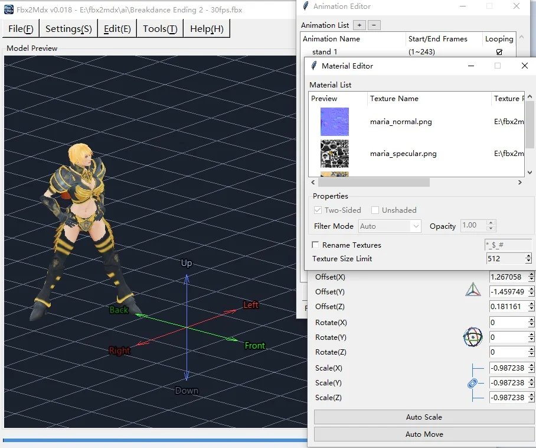

<a href="https://github.com/GoldenEggCN/Fbx2Mdx-release/releases/latest"><b>Download latest release</b></a> &nbsp;·&nbsp; <a href="https://goldeneggcn.github.io/Fbx2Mdx-release/">Full introduction (with GIF demos)</a> &nbsp;·&nbsp; <a href="https://www.hiveworkshop.com/threads/fbx2mdx-easily-convert-fbx-glb-to-wc3-model.373975/">Hive Workshop thread</a>

---

### What is it?

A model format conversion tool.

It lets you easily convert common model formats such as FBX/GLB into the model format used by Warcraft III.

Beginner-friendly and easy to use - one-click operation, no professional tools or plugins required.

High compatibility and stability spare you from all kinds of special problems.

### Features

- Supports preserving the model's initial bind/rest pose.
- Supports MDX classic mode restoring smooth weight behaviour.
- Supports MDX auto-adding attachment points and collision shapes.
- Supports editing offset, rotation, scale and other parameters.
- Supports quickly merging animation data that shares the same skeleton.
- Supports optimizing the model and animations to reduce file size.

### Contact

Author - **GoldenEggCN** 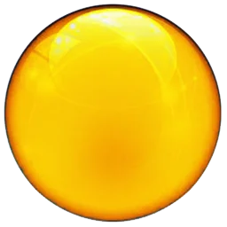

---

## Effect Demonstration

FBX: 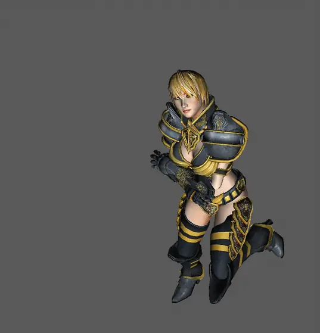 → MDX: 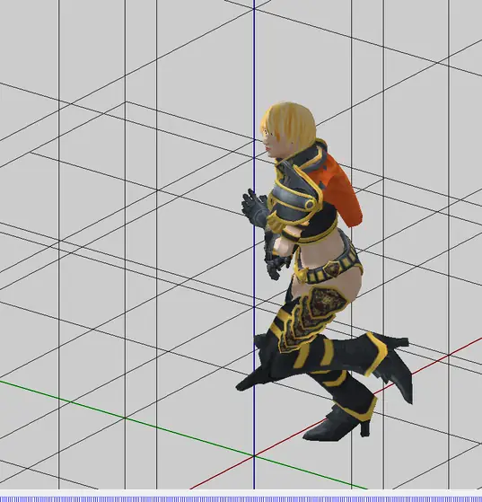

**As you can see, even when converted to classic MDX, it can still maintain smooth dancing poses and movements.**

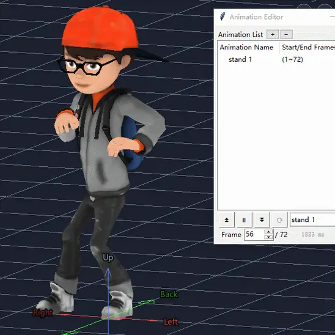 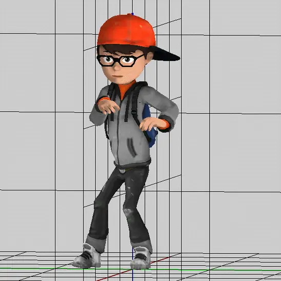

**Quickly adjust the model with operations such as translation, rotation, and scaling.**

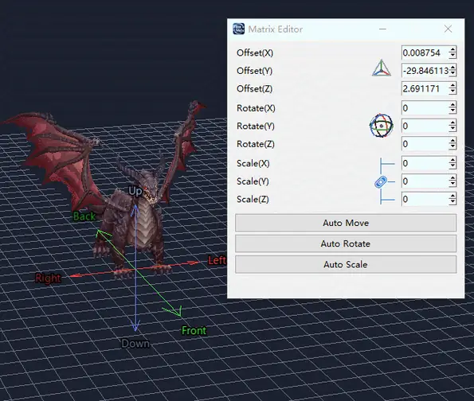 

 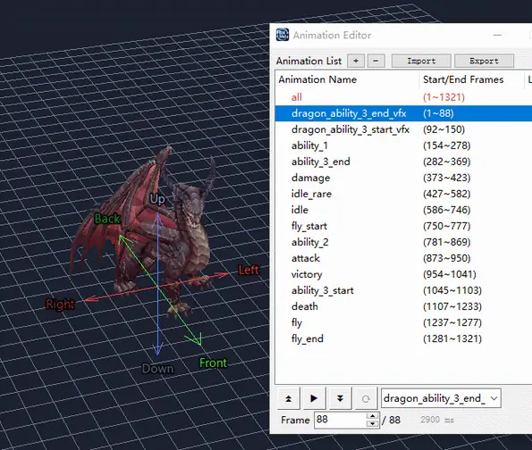

The **"Reduce Polygons"** feature can drastically cut down vertex counts and ease the rendering load for games.

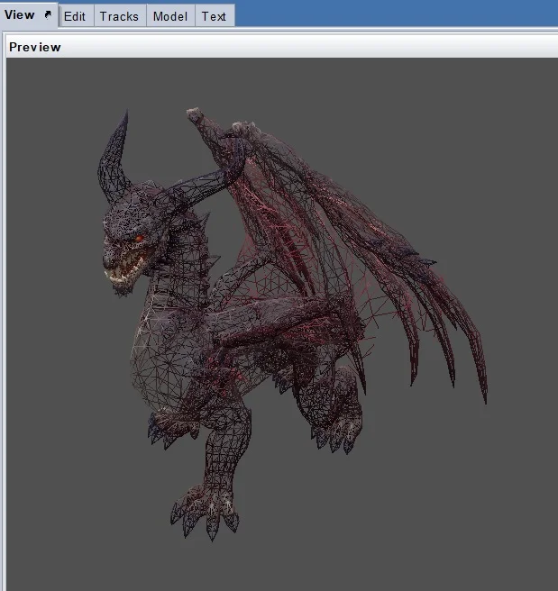 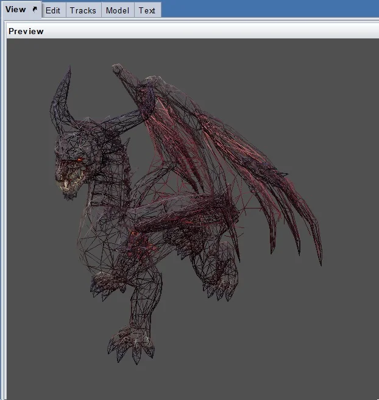

**You can also synthesize more animations for her... provided there is a source with the same skeleton.**

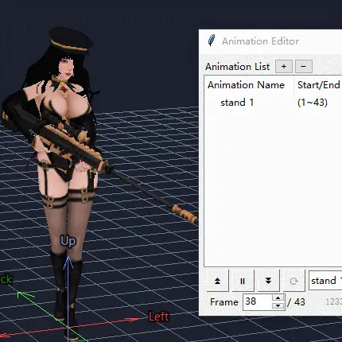 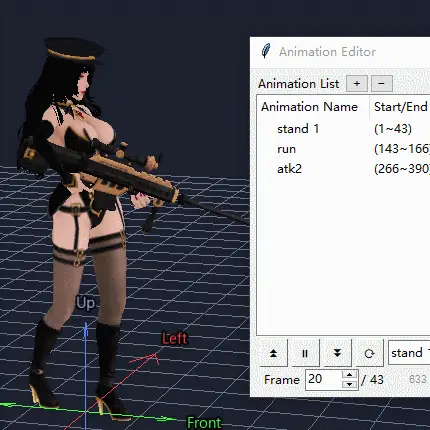 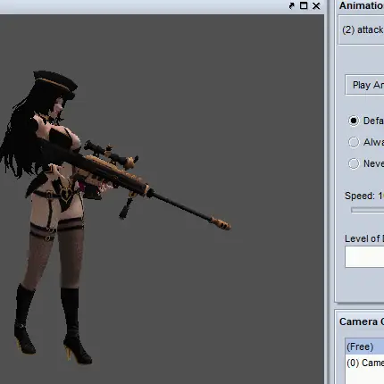

The "**attachment points**" required by the game will automatically recognize the bones and be added to the model.

Of course, there are also material textures.

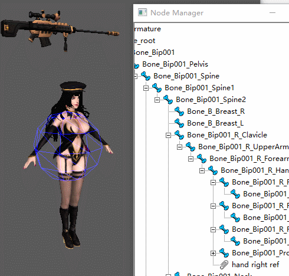 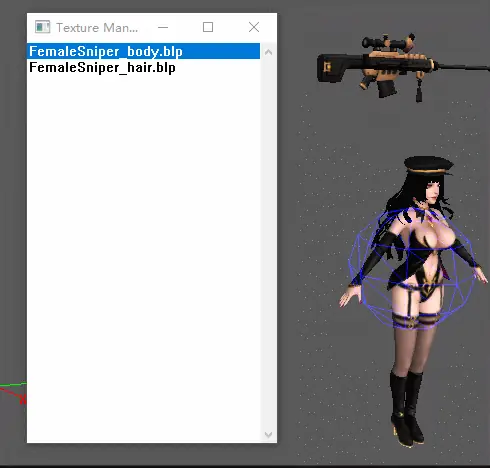

**If you want to create a mirror image... simply set the scale value to a negative number.**

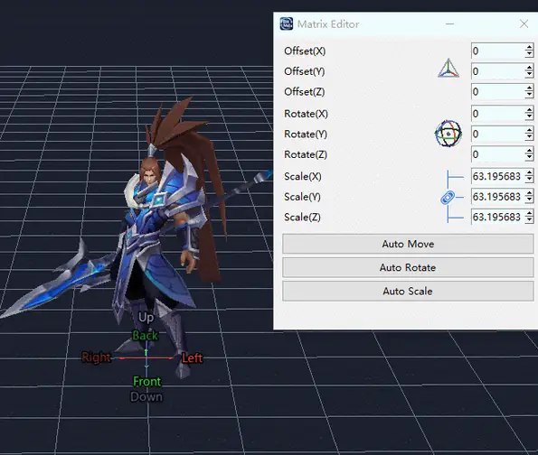

Adjusting the **“Denoise”** and **“Smoothing”** levels of the animation, this will make character movements much smoother.

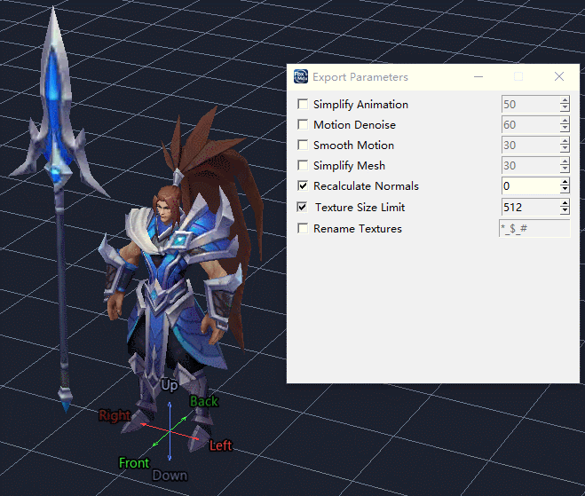

**origin → denoise → denoise & smoothing**

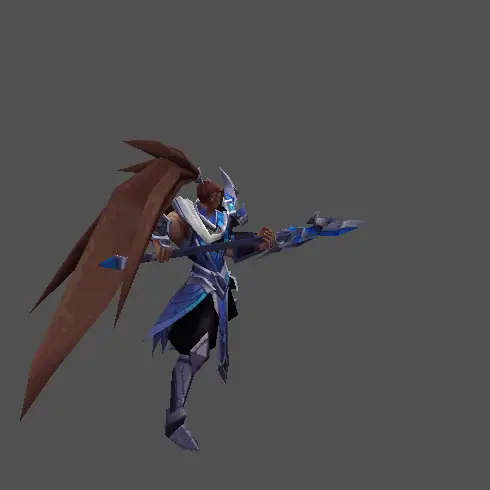 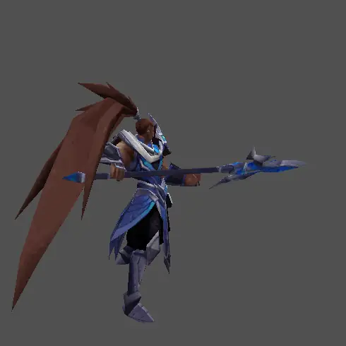 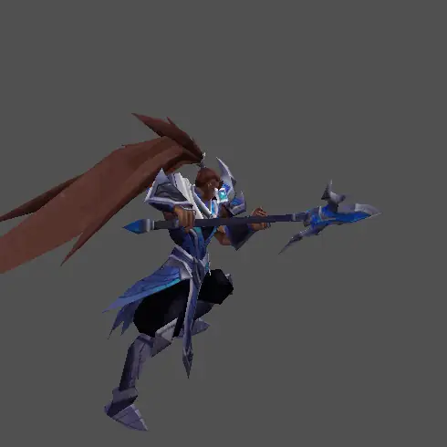

**The topology of AI-generated models is often messy, with high polygon counts and difficult skinning workflows.**

But now you can use this **"Retopology and Bake"** tool to quickly reconstruct your models.

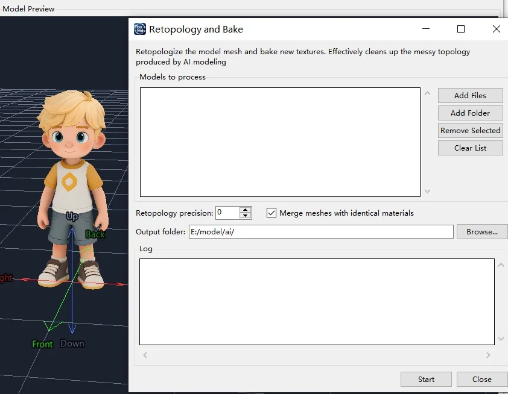

After retopology, the model 's feature has its vertex count reduced by a whopping 50%! Moreover, the mesh topology becomes much cleaner.

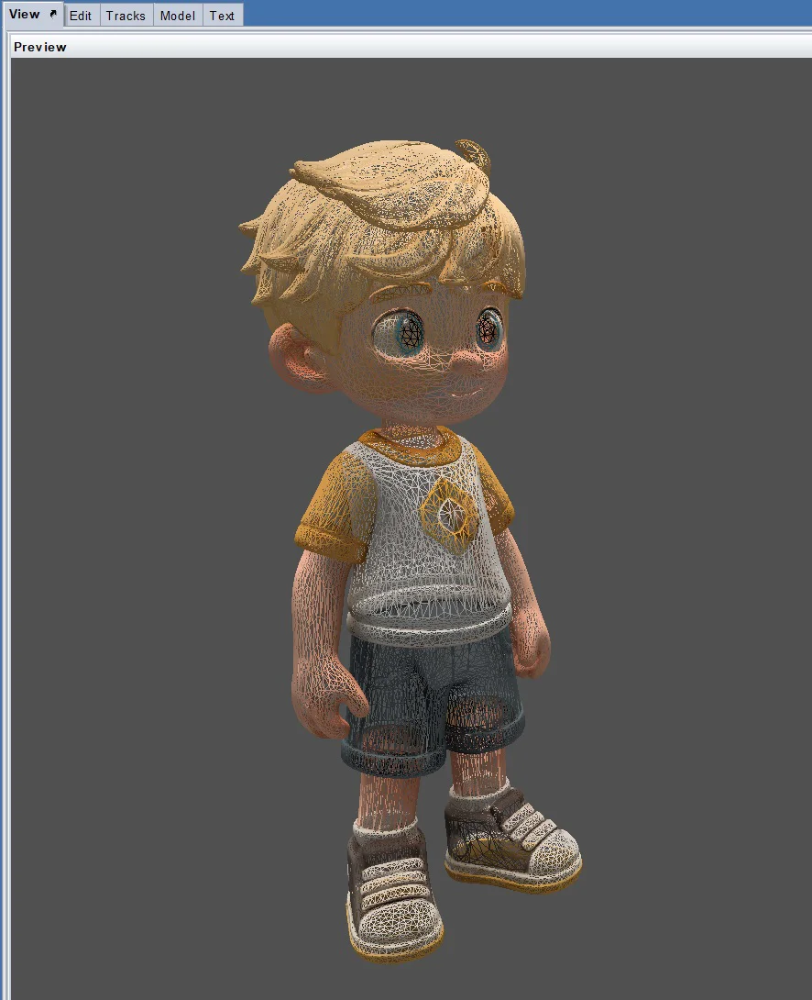 → 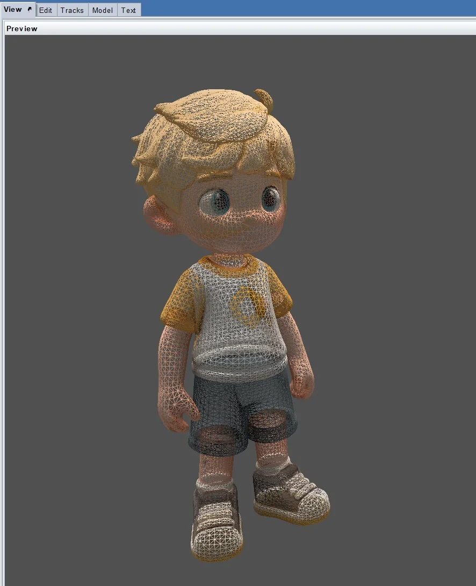

And the color blocks on the texture maps also become neater, you will find it much easier to paint color patterns on it.

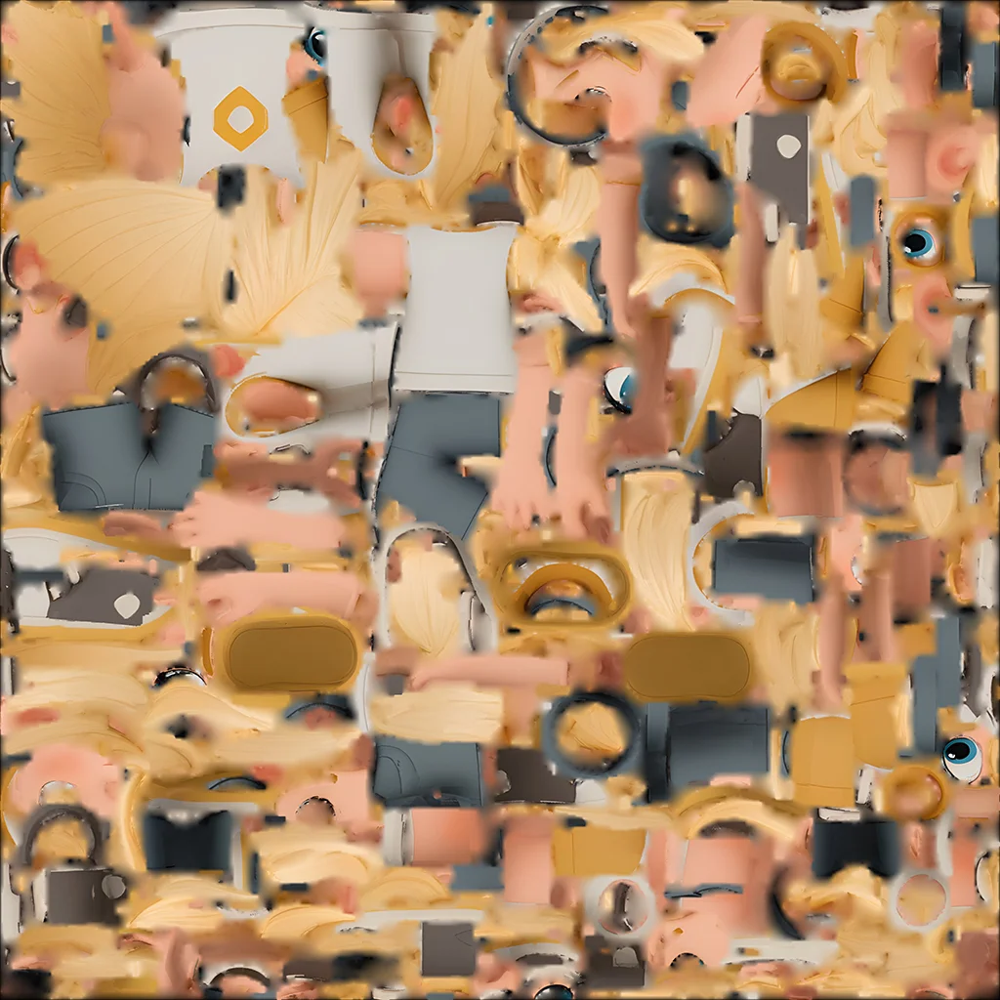 → 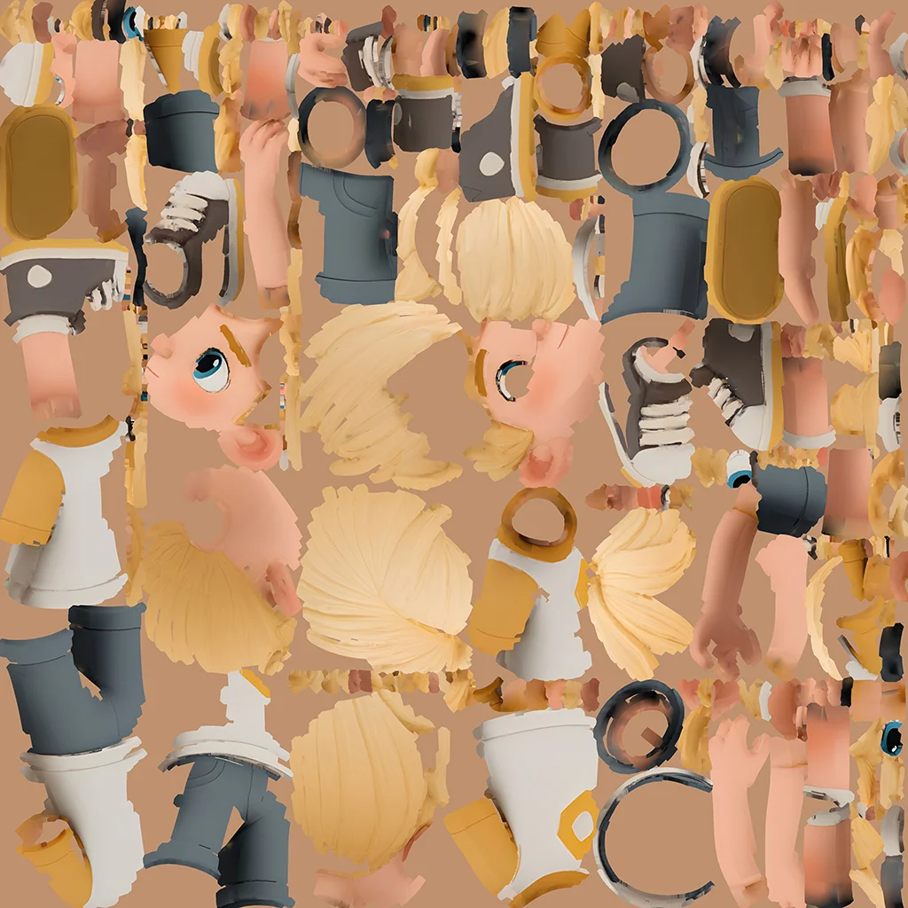

**Fortunately, this process preserves the model's skin weights and skeletal animations!**

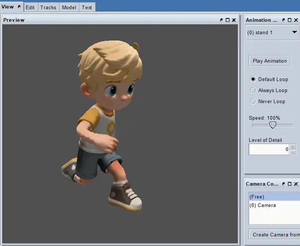

---

### FAQ

<b>Q: Is this software paid?</b>

A: It is completely free. In the future, only certain AI features maybe charged for.

<b>Q: Does the converted MDX model come with animations? Can it convert particle effects?</b>

A: If the original model has animations, the converted MDX model will retain them. As for particle effects, they are native to the game engine and not stored inside model files, so particle effects cannot be converted.

<b>Q: Why does this software take a long time to import and export, and why does the exported FBX take up more disk space?</b>

A: The software bakes all of the model's skeletal animations intokeyframes, so that they adapt to almost every game engine andfully reproduce the animation. This trades time and disk space forcompatibility - a necessary compromise.

<b>Q: Some people have already used AI to create a DLL that can read and recognize all types of Blizzard model resources in-game. Why do we still need a converter?</b>

A: Blizzard's model formats are very simple and stable. Butclosed-source formats like FBX tend to be wildly varied and messy,so reading them directly in-game is very unrealistic - the only wayto use them is through conversion.

<b>Q: What makes this converter different from other lightweight MDX converters or plugins?</b>

A: It is more like an FBX editor, or an "FBX purifier". It turns allkinds of FBX files into more stable versions so that they can bepassed between various modeling software and game engineswithout obstacles. Therefore it is not limited to Blizzard gameresources; it has an industrial-grade pipeline and betterextensibility.

## Enjoy!
